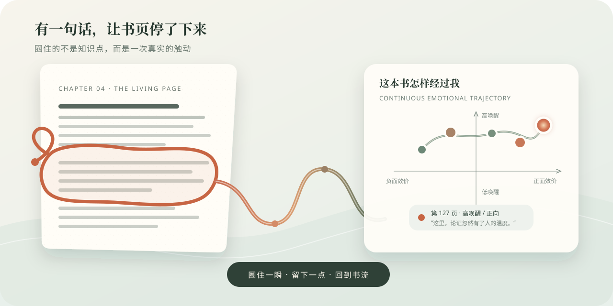

<p align="center">
  
</p>

<p align="center">
  
  <a href="https://github.com/jinming4869/pdf-flow-reader/releases/tag/v4.0.0"></a>
  
  
  
  <a href="LICENSE"></a>
</p>

<p align="center">
  <strong>让 PDF 阅读和轻吻纸质书一样好玩。</strong><br />
  <sub>Make reading PDFs as delightful as gently kissing a paper book.</sub><br />
  <sub>PDF を読むことを、紙の本にそっと口づけるように楽しく。</sub><br />
  <sub>Haz que leer un PDF sea tan placentero como besar suavemente un libro de papel.</sub>
</p>

> [!IMPORTANT]
> 本页以 **v5「航迹」完成后的体验**讲述产品愿景；当前可下载的稳定版仍为 **v4.0.0「希声」**。航迹的套索、情绪图谱与 AI 书架尚未进入公开安装包。

---

## 今晚，你打开一份 PDF

它可能是一篇四十页的论文，也可能是一本五百页的扫描书。你本来只想读十分钟，却先被页码、滚轮、窗口和待办事项提醒：你仍坐在现实世界里。

「夜晚的书斋」没有立刻把工具栏推到你面前。

纸页从一张柔和的底稿里慢慢显影，书名安静地落下。载入不是等待，而是进入。你选定一种阅读天气，按下开始，页面便替双手接过滚动。真实世界没有消失，只是暂时退到了书页以外。

<p align="center">
  
</p>

<p align="center"><sub>进入书斋 · 文件、阅读记录与偏好首先留在本机</sub></p>

> “对于一款伴读 PDF 产品，我们的侧重点不是‘阅读中的思维动作’，而是‘阅读中的情感体验’。思维动作只是情感体验的一种；整体上，它应当成为一种情感引擎，推动我们耐心读完一本电子书。”

这就是「航迹」的起点：它不试图替你理解一本书，而是让你更愿意留在书里。

---

## 书页开始流动

最初的速度很宽容。若你刚打开一本新书，或离开很久才回来，书斋会用约 90 秒重新建立节奏；若你只是拖动、暂停或回看了一小会儿，约 30 秒就够了。

速度在当前档位内部缓缓升高，靠近这一档更有挑战、却仍来得及阅读的位置，绝不偷偷跨入下一档。游戏难度轻轻抬高，注意力随之被唤醒；任何时候，你仍可以暂停、退回或亲手调整它。

这不是用倒计时逼人读完，也不是替人安排“二十分钟速读”。它只是制造一种可以恢复、可以拒绝、刚好值得投入的紧张感。

<p align="center">
  
</p>

<p align="center"><sub>纸页流动 · 数字准确地告诉你速度，名字负责告诉身体这是什么感受</sub></p>

- **4–64 px/s 平滑自动滚动**，开始、暂停与恢复都有缓冲。
- **字/分与词/分同时估算**，排除空格与标点；只在对应语言达到占比时出现。
- **扫描 PDF 自动补 OCR**，只照顾当前页附近，不让整本书堵住眼前这一页。
- **大型文档分区渲染**，纸页底稿先出现，高清画面随后清楚抵达。
- **跳页真正取消旧工作**，已经离开的渲染、识别和声音不会迟到。

---

## 同一阵心跳，被六种天气重新命名

速度提高时，人感到的也许只是“有点跟不上”。书斋却把这种唤醒重新写进一个虚构世界：雪国的雾、散步的脚步、长日的一道痕、曲水中的酒杯、迎面的强风，以及快得来不及逐一命名的繁盛万物。

这层虚构并不掩盖数字。**档位由真实的 px/s 决定，阅读估算也保持可比较；色彩、声音和名字则让身体的节奏与书流的气氛匹配。**

<p align="center">
  
</p>

| 阅读天气 | 声音怎样陪伴 |
| --- | --- |
| **雪国朦胧** | 以舒适速度逐句随读，提前准备后续可读片段，并避开页眉页脚 |
| **美学散步** | 以 1.5–2.5× 追随纸页，略去脚注、旁注、括号与来不及的岔路 |
| **长日留痕** | 阅读线聚焦视点；按 `R` 或乐符，只读线下最近一句 |
| **流觞曲水** | 阅读线隐去；越过一段时，让下一自然段的首句泛起声音 |
| **强风吹拂** | 顶部开启点句模式，点击 PDF 中的完整句子，点哪里读哪里 |
| **万物繁盛** | 页面高速流动，声音不主动追赶，仍只响应你点到的那一句 |

<p align="center">
  
</p>

<p align="center"><sub>万物繁盛 · 声音不占据阅读，只在你点到一句话时出现</sub></p>

中英日与混排文本会被送往适合的本地声音。页眉、页脚、注释和括号不应在不合时宜的地方打破节奏；换页、暂停或停止时，旧朗读 worker 会真正结束。

---

## 直到某一页，让你停下来

不是每次停顿都因为没跟上。

有时，一句话让你生气；一张图让你困惑；一个脚注忽然照亮了前面几十页。你拿起页面边缘的丝带环，纸页与声音随即暂停。套索不是僵硬的矩形框，而是一根有手感的墨线：你绕过无关的字，圈住真正想带走的那一小块纸面。

松手之后，高清截图先在本机落盘。没有网络也没关系，没有模型也没关系——这一刻已经成为一枚不会丢失的阅读痕迹。

<p align="center">
  
</p>

<p align="center"><sub>航迹概念图 · 圈住一瞬，留下一点，再亲手回到书流</sub></p>

---

## 它不是一条笔记，而是一个情绪坐标

书斋不替你猜情绪。截图保存后，一张极简的连续坐标面板轻轻出现：

- 横轴从负面效价走向正面效价。
- 纵轴从低唤醒走向高唤醒。
- 你可以落在任何位置，不必从“快乐、悲伤、愤怒”几个标签里挑一个近似答案。

这次套索也许落在高唤醒的负向区域——它让你不安，却值得记住。下一次也许安静地落在舒缓与满足之间。久而久之，一本 PDF 不只剩下阅读进度，还长出一条按页码连接的情绪航迹。

点击任何一点，都能回到当时的截图、原书位置与那句复述。它记录的不是“我摘抄过什么”，而是“这本书曾怎样经过我”。

你按下“回到书流”，套索和坐标收起。页面先以熟悉的速度重新出发，再用 30 秒或 90 秒把挑战慢慢交还给你。

---

## 一句复述可以迟到，书流不必等

截图与情绪坐标保存以后，AI 才在背景里尝试写下一句关键复述。目标是 1–3 秒，但它从来不是回到阅读的门票。

断网、超时或 API 失败时，痕迹依然完整，只是暂时没有“回声”；联网以后可以补生成。读者不需要盯着加载动画，更不会因为模型的一次失败失去刚刚圈住的时刻。

这条边界把 AI 分成两种不同的存在：

| 发生在哪里 | AI 做什么 | 如何保护心流 |
| --- | --- | --- |
| **流动阅读中** | 为一次套索生成一句关键复述 | 本地事实先保存；快速、可失败、可补写，不阻塞回流 |
| **合卷后的书架** | 分析、全文总结、LSE Reading Worksheet | 由用户主动触发；长上下文与质量优先，可以等待并选择模型 |

<p align="center">
  
</p>

<p align="center"><sub>阅读本体本地优先，AI 可以失败；重型认知任务在线优先，由人主动召唤</sub></p>

---

## 合卷以后，AI 才走到前台

书架不是阅读界面的控制中心，而是离开心流之后整理航迹的地方。

你打开一本已经读过的书，看见所有套索片段沿着情绪坐标相连。你可以把它们导出到 Zotero 笔记、Obsidian 或专用本地文件夹，也可以为整本书调用已经打磨好的「分析」「综合」「复述」或 LSE Reading Worksheet Prompt。

模型层被抽象成 provider。第一版可以从一个 OpenAI-compatible API 开始，之后接入 OpenAI、SiliconFlow 或其他服务；密钥只在书斋中授权，保存到 macOS Keychain 或 Windows Credential Manager。应用不会读取 Zotero 的配置文件，更不会复制其中的凭据。

Zotero 在这里承担两个清楚的角色：**成熟 Prompt 的来源之一，以及经用户确认后的归档目的地之一。** 它不是阅读本体的运行依赖。

```text
进入书斋
  → 纸页显影
  → 速度在当前天气中缓缓升温
  → 视觉阅读、阅读线与声音共同陪伴
  → 套索圈住一次真实触动
  → 截图与情绪坐标首先本地保存
  → 一句复述在背景里抵达
  → 手动回到书流
  → 合卷后，从书架回看整本书的航迹
```

这就是「航迹」想完成的一次阅读：**短期的快乐与唤醒，不是终点；它们被用来保护一件缓慢而长期有益的事——耐心读完一本书。**

---

## 当前可下载：v4.0.0「希声」

公开安装包已经包含连续阅读、六档速度、密度估算、附近页 OCR、中英日本地 TTS 与按档位变化的朗读逻辑。v5「航迹」的套索、情绪图谱、AI 复述和书架工作流仍在实现路线中，设计记录可在 [`docs/v5-hangji/`](./docs/v5-hangji/README.md) 查看。

| 平台 | 下载 | 说明 |
| --- | --- | --- |
| macOS Apple Silicon | [`night-study-4.0.0-mac-arm64.zip`](https://github.com/jinming4869/pdf-flow-reader/releases/download/v4.0.0/night-study-4.0.0-mac-arm64.zip) | 适用于 M 系列芯片，解压后打开「夜晚的书斋.app」 |
| Windows x64 | [`night-study-4.0.0-windows-portable.exe`](https://github.com/jinming4869/pdf-flow-reader/releases/download/v4.0.0/night-study-4.0.0-windows-portable.exe) | 便携版，无需安装 |
| 完整性校验 | [`SHA256SUMS.txt`](https://github.com/jinming4869/pdf-flow-reader/releases/download/v4.0.0/SHA256SUMS.txt) | 用于核对下载文件是否完整 |

下载后可用系统工具核对文件名对应的哈希：

```sh
# macOS
shasum -a 256 night-study-4.0.0-mac-arm64.zip

# Windows PowerShell
Get-FileHash night-study-4.0.0-windows-portable.exe -Algorithm SHA256
```

### 三步开始

1. 打开「夜晚的书斋」。
2. 选择一份 PDF，或把文件拖进阅读区域。
3. 调节速度，让纸页按你的节奏流动；需要时按 `H` 开启希声。

当前版本尚未购买开发者证书。macOS 若提示无法验证开发者，请右键应用并选择“打开”；Windows 若出现 SmartScreen，请先核对下载来源与 SHA-256，再选择“更多信息”。当前正式资产支持 macOS Apple Silicon 与 Windows x64；Intel macOS 和 Linux 暂无安装包。

---

## 你可能会喜欢它，如果……

- 你常读论文、报告、书稿和几百页的扫描 PDF。
- 你想减少滚轮操作，但仍希望以视觉阅读为主。
- 你会在中文、英文和日文材料之间切换。
- 你在意文件留在本机，不愿把整份文档交给云端。
- 你相信阅读不仅是提取信息，也是一段值得被记住的情感经历。
- 你喜欢工具有一点气质，却不想被动画和按钮包围。

## 快捷键

| 按键 | 作用 |
| --- | --- |
| `Space` | 暂停 / 继续自动滚动 |
| `H` | 开启 / 关闭希声 |
| `R` | 在“长日留痕”中朗读阅读线下方最近一句 |
| `Esc` | 立即停止当前朗读 |
| `D` | 打开本地语音诊断面板 |

<details>
<summary><strong>从源码运行</strong></summary>

基础浏览器版需要 Node.js 18 或更高版本。完整离线 TTS 体验以桌面发布包，或已经完成 runtime 构建的开发环境为准。

### macOS

```sh
./start-reader.sh
```

也可以带文件路径启动：

```sh
./start-reader.sh "/path/to/document.pdf"
```

### Windows

双击 `start-reader.cmd`，或在 PowerShell 中运行 `start-reader.ps1`。

</details>

<details>
<summary><strong>开发与构建桌面版</strong></summary>

推荐使用 Node.js 24、Python 3.12 与 [uv](https://docs.astral.sh/uv/)。

```sh
npm ci
uv sync --project runtime/tts-multilingual --frozen
uv run --project runtime/tts-multilingual --frozen python scripts/build-multilingual-runtime.py
uv run --project runtime/tts-multilingual --frozen python scripts/prepare-english-model.py
npm test
npm run app:start
```

生成发布包：

```sh
npm run app:dist
```

模型由脚本从固定地址下载，并在打包前校验字节数与 SHA-256；大文件不进入 Git。

</details>

---

## 技术与许可

- 界面：原生 HTML、CSS、JavaScript
- PDF 渲染：[Mozilla PDF.js](https://github.com/mozilla/pdf.js)
- 本地 OCR：[Tesseract.js](https://github.com/naptha/tesseract.js)
- 本地语音：[Kokoro](https://github.com/hexgrad/kokoro)、ONNX Runtime、Misaki、pyopenjtalk
- 桌面运行时：[Electron](https://www.electronjs.org/)
- 自动化测试：289 项 Node 回归测试与 5 项 CJK worker 单测

项目代码采用 [MIT License](./LICENSE)。第三方组件、模型与字典许可见 [`THIRD_PARTY_NOTICES.md`](./THIRD_PARTY_NOTICES.md)。版本变化见 [`CHANGELOG.md`](./CHANGELOG.md)。

<p align="center">
  
  &nbsp;&nbsp;
  
</p>

<p align="center"><sub>06:00–18:00 使用日间图标，18:00–06:00 使用夜间图标。</sub></p>
