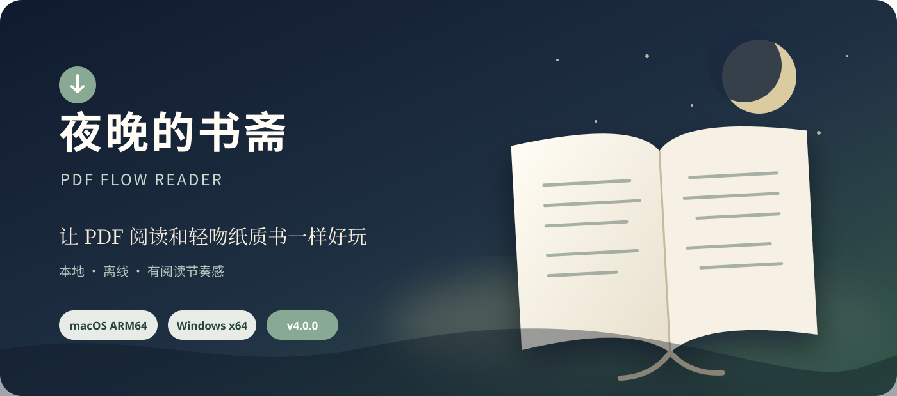
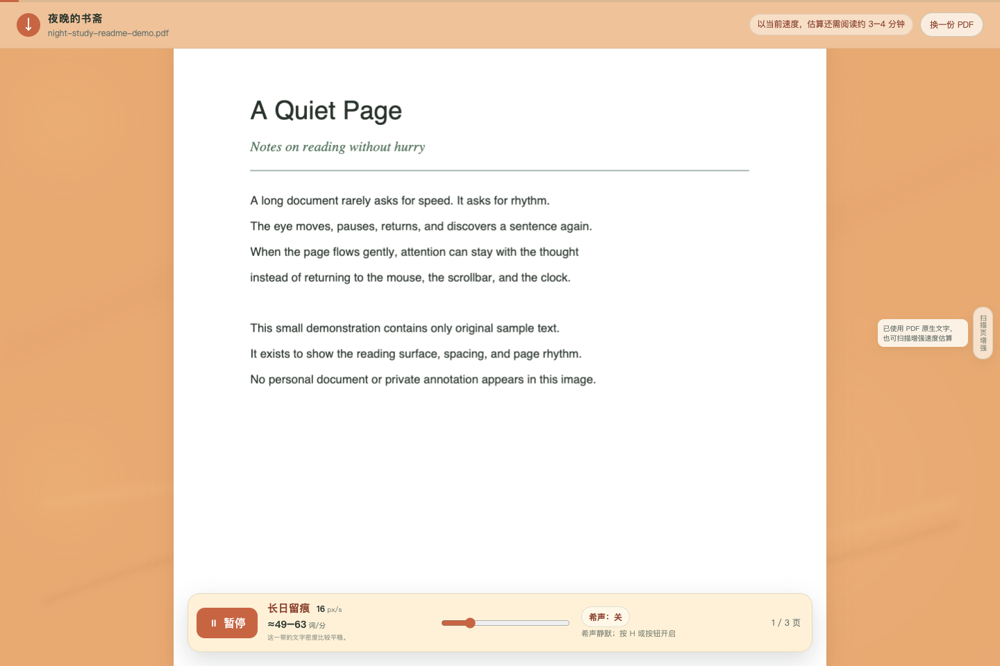
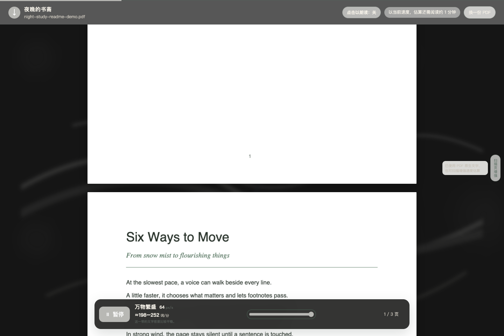
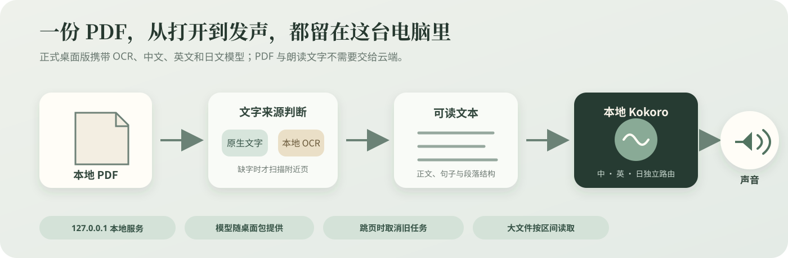
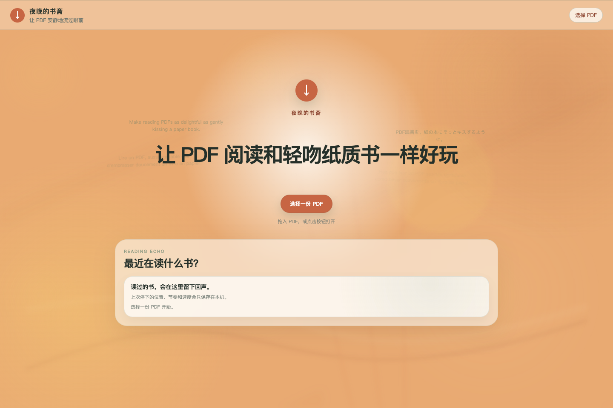
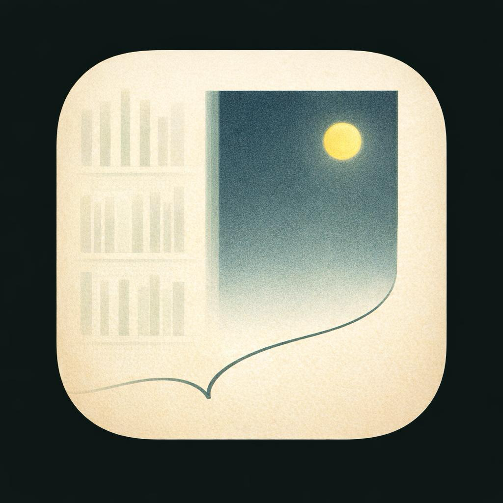
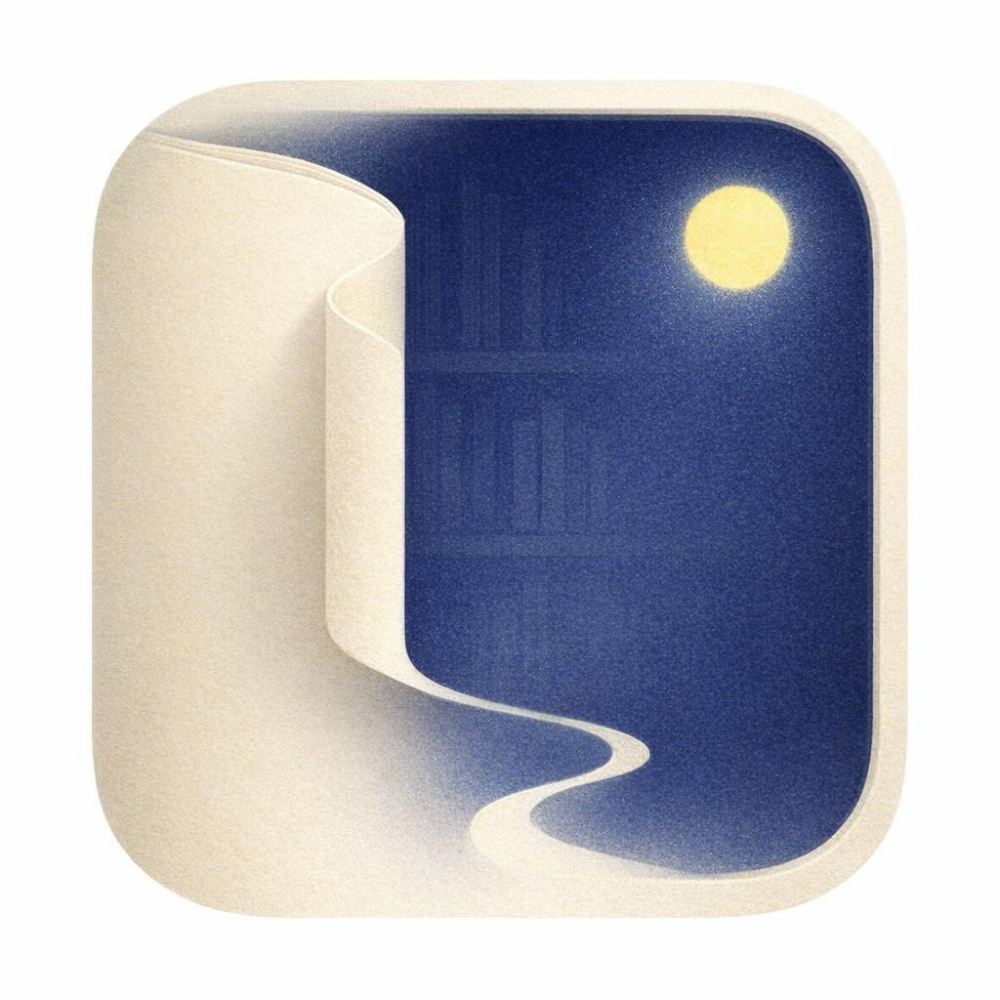

<p align="center">
  
</p>

<p align="center">
  <a href="https://github.com/jinming4869/pdf-flow-reader/releases/tag/v4.0.0"></a>
  
  
  
  <a href="LICENSE"></a>
</p>

<p align="center">
  <strong>让 PDF 阅读和轻吻纸质书一样好玩。</strong><br />
  <sub>Make reading PDFs as delightful as gently kissing a paper book.</sub>
</p>

<p align="center">
  <a href="https://github.com/jinming4869/pdf-flow-reader/releases/download/v4.0.0/night-study-4.0.0-mac-arm64.zip"><strong>下载 macOS 版</strong></a>
  &nbsp;·&nbsp;
  <a href="https://github.com/jinming4869/pdf-flow-reader/releases/download/v4.0.0/night-study-4.0.0-windows-portable.exe"><strong>下载 Windows 版</strong></a>
  &nbsp;·&nbsp;
  <a href="https://github.com/jinming4869/pdf-flow-reader/releases/tag/v4.0.0">查看 Release</a>
</p>

<p align="center"><sub>PDF、OCR 与中英日朗读默认在本机完成；模型随桌面包提供。</sub></p>

---

## 故事从“再滚一下”开始

读一篇几十页的论文时，手常常比眼睛更忙：向下滚一点，停住；读完两段，再滚一点。刚进入作者的思路，注意力又被触控板和页码拉回现实。

**「夜晚的书斋」从这个很小的疲惫开始。** 打开 PDF，纸页会按你选择的速度缓缓流动。你仍然自己读、自己停、自己决定哪里值得回看；应用只替你接住那些机械动作。

<p align="center">
  
</p>

<p align="center"><sub>长日留痕 · 按 R 或乐符，朗读阅读线下方最近一句；图中为合成演示 PDF</sub></p>

---

## 让纸页流动，而不是把文档变成播放器

「夜晚的书斋」首先是一间安静的阅读室。

- **4–64 px/s 平滑自动滚动**，开始与暂停都有缓冲，不让纸页突然失速。
- **按文字密度估算阅读速度**，分别显示字/分、词/分和剩余阅读时间。
- **大型 PDF 按区间读取**，先出现纸页底稿，再逐步显影当前页附近的高清画布。
- **跳页就取消旧任务**，不让已经离开的渲染、OCR 或声音迟到。
- **减少动画友好**，尊重系统的 `prefers-reduced-motion` 设置。


---

## 一条滑杆，六种阅读天气

速度不只是一串数字。

慢下来时，页面像雪后的原野；再快一点，像沿着城市与思想散步；到了最快的两档，背景沉入风与夜色，声音也不再主动追赶你。六档速度分别决定视觉氛围、文字密度反馈，以及“希声”应该怎样出现。

<p align="center">
  
</p>

| 阅读节奏 | 希声怎样出现 |
| --- | --- |
| **雪国朦胧** | 舒适随读，并预备后续可读片段；需要时提前准备下一页文字 |
| **美学散步** | 以 1.5–2.5× 跟随纸页，略去脚注、旁注和来不及的岔路 |
| **长日留痕** | 保持安静；按 `R` 或乐符，只读阅读线下方最近一句 |
| **流觞曲水** | 越过一个自然段时，让下一段的首句泛起声音 |
| **强风吹拂** | 开启点句后，点击 PDF 中的完整句子即可朗读 |
| **万物繁盛** | 页面高速流动，声音仍只响应你点到的那一句 |

---

## 希声：声音应当靠近阅读，而不占据阅读

传统 TTS 常常从第一页一路念到底。它很勤奋，却未必知道你正看到哪里。

“希声”沿着当前页面、阅读线和速度档位工作：慢时陪你走，稍快时替你略去枝节，中速时等待一个明确动作，最快时把决定权交还给鼠标。中英、日英混排会分别路由到适合的本地声音，再拼成连续音频。

当你跳页、暂停、换文档或停止朗读，旧 worker 会真正结束；已经离开的句子不会在新页面里迟到。

<p align="center">
  
</p>

<p align="center"><sub>万物繁盛 · 顶部开启点句模式后，点击 PDF 中的完整句子即可朗读</sub></p>

---

## 一份 PDF，从打开到发声，都留在本机

v4.0.0 的正式桌面路径默认使用随包提供的本地资源：

- PDF.js 先读取原生文字层。
- 原生文字不足时，Tesseract.js 只识别当前页附近的扫描页。
- 英文使用本地 Kokoro q8；中文、日文使用 Kokoro v1.0 int8 与自包含 CJK worker。
- 最近阅读、速度和界面偏好只写入本地存储。
- 本地服务只监听 `127.0.0.1`。

<p align="center">
  
</p>

> PDF 文件、OCR 文字与内置朗读内容都在本机处理。模型已随桌面包提供，首次朗读不需要另行下载。

---

## 下载与安装

| 平台 | 下载 | 说明 |
| --- | --- | --- |
| macOS Apple Silicon | [`night-study-4.0.0-mac-arm64.zip`](https://github.com/jinming4869/pdf-flow-reader/releases/download/v4.0.0/night-study-4.0.0-mac-arm64.zip) | 适用于 M 系列芯片，解压后打开「夜晚的书斋.app」 |
| Windows x64 | [`night-study-4.0.0-windows-portable.exe`](https://github.com/jinming4869/pdf-flow-reader/releases/download/v4.0.0/night-study-4.0.0-windows-portable.exe) | 便携版，无需安装 |
| 完整性校验 | [`SHA256SUMS.txt`](https://github.com/jinming4869/pdf-flow-reader/releases/download/v4.0.0/SHA256SUMS.txt) | 用于核对下载文件是否完整 |

下载后可用系统工具核对文件名对应的哈希：

```sh
# macOS
shasum -a 256 night-study-4.0.0-mac-arm64.zip

# Windows PowerShell
Get-FileHash night-study-4.0.0-windows-portable.exe -Algorithm SHA256
```

### 三步开始

1. 打开「夜晚的书斋」。
2. 选择一份 PDF，或把文件拖进阅读区域。
3. 调节速度，让纸页按你的节奏流动；需要时按 `H` 开启希声。

<p align="center">
  
</p>

<p align="center"><sub>欢迎页 · 选择或拖入 PDF，阅读记录与偏好只写入本地存储</sub></p>

### 未签名应用提示

当前版本尚未购买开发者证书：

- **macOS**：若提示无法验证开发者，请右键应用并选择“打开”。
- **Windows**：若 SmartScreen 提示风险，请先核对下载来源与 SHA-256，再选择“更多信息”。

当前正式资产支持 macOS Apple Silicon 与 Windows x64；Intel macOS 和 Linux 暂无安装包。

---

## 你可能会喜欢它，如果……

- 你常读论文、报告、书稿和几百页的扫描 PDF。
- 你想减少滚轮操作，但仍希望以视觉阅读为主。
- 你会在中文、英文和日文材料之间切换。
- 你在意文件留在本机，不愿把整份文档交给云端。
- 你喜欢工具有一点气质，却不想被动画和功能按钮包围。

---

## 快捷键

| 按键 | 作用 |
| --- | --- |
| `Space` | 暂停 / 继续自动滚动 |
| `H` | 开启 / 关闭希声 |
| `R` | 在“长日留痕”中朗读阅读线下方最近一句 |
| `Esc` | 立即停止当前朗读 |
| `D` | 打开本地语音诊断面板 |

---

<details>
<summary><strong>从源码运行</strong></summary>

基础浏览器版需要 Node.js 18 或更高版本。完整离线 TTS 体验以桌面发布包，或已经完成 runtime 构建的开发环境为准。

### macOS

```sh
./start-reader.sh
```

也可以带文件路径启动：

```sh
./start-reader.sh "/path/to/document.pdf"
```

### Windows

双击：

```text
start-reader.cmd
```

或在 PowerShell 中运行 `start-reader.ps1`。

</details>

<details>
<summary><strong>开发与构建桌面版</strong></summary>

推荐使用 Node.js 24、Python 3.12 与 [uv](https://docs.astral.sh/uv/)。

```sh
npm ci
uv sync --project runtime/tts-multilingual --frozen
uv run --project runtime/tts-multilingual --frozen python scripts/build-multilingual-runtime.py
uv run --project runtime/tts-multilingual --frozen python scripts/prepare-english-model.py
npm test
npm run app:start
```

生成发布包：

```sh
npm run app:dist
```

模型由脚本从固定地址下载，并在打包前校验字节数与 SHA-256；大文件不进入 Git。

</details>

---

## 技术与许可

- 界面：原生 HTML、CSS、JavaScript
- PDF 渲染：[Mozilla PDF.js](https://github.com/mozilla/pdf.js)
- 本地 OCR：[Tesseract.js](https://github.com/naptha/tesseract.js)
- 本地语音：[Kokoro](https://github.com/hexgrad/kokoro)、ONNX Runtime、Misaki、pyopenjtalk
- 桌面运行时：[Electron](https://www.electronjs.org/)
- 自动化测试：289 项 Node 回归测试与 5 项 CJK worker 单测

项目代码采用 [MIT License](./LICENSE)。第三方组件、模型与字典许可见 [`THIRD_PARTY_NOTICES.md`](./THIRD_PARTY_NOTICES.md)。版本变化见 [`CHANGELOG.md`](./CHANGELOG.md)。

<p align="center">
  
  &nbsp;&nbsp;
  
</p>

<p align="center"><sub>06:00–18:00 使用日间图标，18:00–06:00 使用夜间图标。</sub></p>
